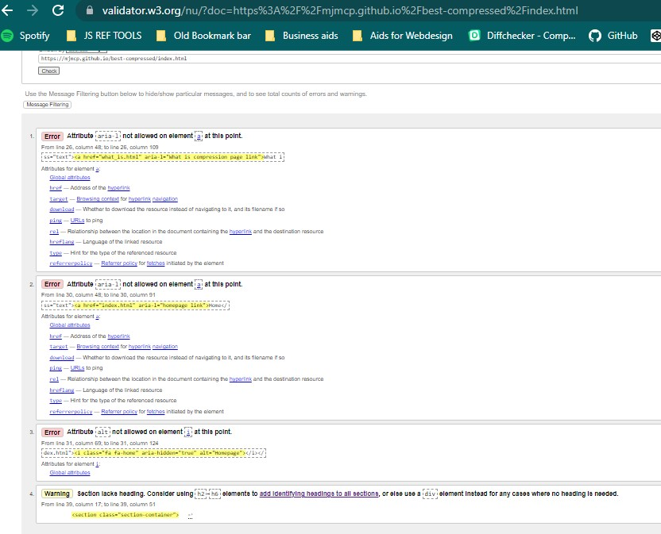

# <em>Best Compressed</em>

The Best Compressed website is a public information website that provides advice and user-led suggestions for those who use compression garments. Its aim is to present the information about the various types of compression garments available and to clear up some of the confusion about the purpose of one type over another.

The live site can be accessed through this [link](https://mjmcp.github.io/best-compressed/index.html).

 

# Contents
- [User Experience UX](#user-experience-ux)
  - [User Stories](#user-stories)
  - [Wireframes](#wireframes)
  - [Site Structure](#site-structure)
  - [Design Choices](#design-choices)
    - [Typography](#typography)
    - [Colour Scheme](#colour-scheme)
- [Features](#features)
  - [Home](#home)
    - [Navigation Bar](#navigation-bar)
    - [Introduction](#introduction)
    - [Sub-Sections](#sub-sections)
    - [Footer](#footer)
  - [What is a Compression Garment](#what-is-a-compression-garment-page)
  - [Wear & Care](#wear-and-care-page)
  - [Tried & Tested](#tried-and-tested-page)
- [Future Features](#features-left-to-implement)
- [Technologies Used](#technologies-used)
- [Testing](#testing)
    - [Validator Testing](#validator-testing)
    - [Unfixed Bugs](#unfixed-bugs)
- [Deployment](#deployment)
- [Credits](#credits)
  - [Content](#content)
  - [Media](#media)
- [Acknowledgements](#acknowledgements)

# User Experience UX

The ideal user of this site will be:
  - over 16 years old.
  - a novice wearer of the garments used in compression therapy.

[Back to Contents](#contents)

## User Stories  
- As a user, I can find the information I seek quickly.
- As a user, I can understand the information as it is presented to me.
- As a user, I can clearly make out the links to each page.
- As a user, I can understand the information in the videos.
- As a user, I can leave a message through a provided portal.

[Back to Contents](#contents)

## Wireframes

The wireframes for this site were produced and are hosted on the site [Balsamiq](https://balsamiq.com). Please click [this link](/assets/readme_images/Best%20Compressed.pdf) to view them and the planning notes. 

[Back to Contents](#contents)

## Site Structure

 The style of this site will be simple and uncomplicated due in consideration of the large age scope and possible divides in user prowess with internet technology. Any possible and futher design works will take the computer user generational divide into consideration. 
 
 It consists of 3 formatted pages consisting of a hero image, a main description section and 3 subsequent column sections and 2 additional pages, one with a form box for the collection of data in the aim of creating the database of personal advice from experience compression wearers and another with a thank you message to acknowledge the sent data.  

[Back to Contents](#contents)

## Design Choices

### Typography
The fonts chosen for this project were 'Kavoon' for the headings (h1, h2 etc) and 'ABeeZee' for the body text.
  - Kavoon is considered a Comic/Cartoon style which has a heavy font weight as normal and that appears to be somewhat condensed in the manner of the letter forms. It was chosen to play on the topic of the site until a more formal logo can be designed.
  - ABeeZee is, according to its design Anja Meiners, "a children's learning font. Open, friendly and simple, the definite shapes support the process of learning to read and write." It maintains a clean distinction in letter form as the screen sizes adjust.

  

[Back to Contents](#contents)

### Colour Scheme
The choices for the colour scheme were based on examination of other like purpose sites. The use of primary colours, particularly red was prominent in most of the sites that dealt with medical advice or patient advocacy. I was cautious about using any colours that are strongly associated with one medical condition over another in order to preserve an inclusive environment for any user - this site is not for a specific condition, just for a specific health aid.

To alter in some way from the norm but still maintain an air of familiarity, I chose variations of red and blue to accent the text elements. These colour choices were also checked using Adobe's Color Wheel webpage for suitability for those who suffer with colour blindness.

 

[Back to Contents](#contents)

# FEATURES
## Existing Features
## Home 

### Navigation Bar

  - Situated at the top of the page, the page logo 'BEST COMPRESSED' is shown on the left hand side with the page menu located on the right, listing this HOME page as well as 3 addional pages. Each page is assigned an icon as a visual aid and will have an 'active' line beneath each link as its appropriate page is visited. 

  - Once the site adapts for smaller screen sizes, the page logo will relocate to the center of screen with the menu options underneath it. Due to the length of some of the link names, the icons will be used instead of text when the site adapts. 

[Back to Contents](#contents)

### Introduction
  -   This is a general introduction to the ethos of the site and its aims going forward.
  There is also a content disclaimer which reminds the user that the information here is a general guide and that the best advice comes from those trained and who have full knowledge of their individual situation. A repetition of this will appear in the footer of each page.

 

[Back to Contents](#contents)

### Sub-sections
  -   The 3 columns of this section each contain a seperate image, a brief explanation of the topic matter and a link to the related page within the title of the subsection.

  

[Back to Contents](#contents)

### Footer
   - Fixed at the bottom of the screen, the footer contains the constant Disclaimer relating to the content of the site  on the left hand side.
   - There are also 3 links to relatable social media for the site's content. These three platforms were chosen for their generally understood UI which will aid the cross generational divide. 
   - There is a 'Date Updated' information line to reflect the current nature of the information provided.
   - This will be present on all pages and screen sizes.

[Back to Contents](#contents)

### What is a Compression Garment page
  - Inheriting the layout of the Landing Page, the information presented here explains simply the purposes of a Compression Garment. 
  - The 3 column section uses images to catagorise the 3 main types and provides bulletpoints of the main differences of each type.     
  - The disclaimer for the intent of the site can be seen in the footer along with the social media icons.

[Back to Contents](#contents)

### Wear and Care page
  - Inheriting the layout of the Landing Page, the information in this section will be presented in 3 columns.
  - The first column will contain an image and bullet points containing short 'daily' tips for wear and care of your garments and skin.
  - Two of these columns will host externally sourced videos,  one video on washing and upkeep of compression garments and another on the protection of the skin layer. 
  - Each video will load with controls and muted for optimal user experience. Each video will also have as an addition, the disclaimer as posted by the original content creator.
  - The disclaimer for the intent of the site can be seen in the footer along with the social media icons.

[Back to Contents](#contents)

### Tried and Tested page
  - The current format of this page similar in header and footer layout of its siblings.
  - One section on this page consists of a form box with name, email address and text box fields for contributing to the advice element of the site.
  - The fields are all required once data has been entered into them or the submit button is turned on.
  - The submit button has been styled to react to any pointer hovers and when it is clicked.
  - The second section gives insight into the information desired in the text box field and also provides 3 external links to websites that specialise in medical conditions or situations that require the use of compression garments.
  - The disclaimer for the intent of the site can be seen in the footer along with the social media icons.

  

[Back to Contents](#contents)

### Tried and Tested Thank You Page
  - Once the form has been filled and the submit button actived, the action will bring you to this page with a brief thank you message and reiteration of the promise of an advice page.

  

  - There are no 'active' markers on the navigation bar by design.
  - The call to action button in the middle of the page with return you to the homepage within the current open browser window.
  The disclaimer for the intent of the site as well as the social media icons, can be seen in the footer.

[Back to Contents](#contents)

## Features Left to Implement
 
This site was initially conceived as a public information resource with an option for adaptation depending on user feedback. Some of the features that are intended for the future without feedback are as follows:
 
- Official Logo for use on site and as a watermark for other associated media.
- Advice board where collected tips will be displayed.
- Animation/Pop-up of disclaimer, ensuring that the information reaches the user. 
- Self produced media content: videos and photos to replace all externally sourced content. 
- A possible link page to reputable sellers of accessories once self produced content is in place as current image licencing agreement makes this a conflict. 

[Back to Contents](#contents)

## Technologies Used

In the creation of this project I have used the following:

- Balsamiq to create the wireframes.
- HTML5 to provide the content and structure for the website.
- CSS to provide the styling.
- Github to host and edit the website.
- Gitpod to deploy the website.
- Adobe color website to confirm assessibility of colours used.
- Codegena to create a video embedding code generator.

[Back to Contents](#contents)

## Testing

In the building of the site, the major issues I had to deal with involved the following :

- Weak Design Elements
  - When I first designed the layout, I wanted to keep it clean and simplistic so that it didn't overwhelm the sensibilities of any of the users. However, the combination of 'Dela Gothic One' and 'Lora' proved to be less impactful that I thought. At the beginning of the testing phase, I was advised to rethink this approach and so the fonts "Kavoon" and "ABeeZee" were chosen to replace the original choices. 

- Menu layout and presentation on smaller viewports
  - Due to the length of the text links, I added icons to the links that would become the navigation icons when the site is viewed on a smaller screen.  This was done by adding classes to target the text and icons seperately so they could be hidden or seen as needed. Attention was required for both margin and padding settings for the various size screens but the presentation is equal across the different screen sizes.

- 'Return to Homepage' button with link to homepage
  - The main issue that I encountered with this button was the fact that I expected it to react as the Submit button did on the Tried and Tested page. After many attempts to rectify the possible link issue, I realised that I needed to treat the button layout like an imported image or icon. I used the button element and its attributes as an additional attribute of the a element that actively opens the homepage in the same browser window.

- Video Embedding   
  - When I first attempted to insert a link for the youtube videos that I had selected, I was immediately shown an error message for where the video should appear. My first source of assistance was the Slack channels of CI where I searched for "embed youtube link into html". One member suggested the video embed generator created by Codegena but warned of issues may occur in validation later. I decided to use the generator for the moment as they work for MVP, I have not come across any major issues as of yet but I am aware that this may be an issue in the future. 

[Back to Contents](#contents)

## Validator Testing

  ### HTML with W3C validator
    - index.html

    First issue that was highlighted on all the pages was the labeling error that was within the navigation bar. 
    
  
    
    This was created in 2 parts: the first through a spelling error which was easily corrected and the second by removing an alt property tag that had been included on part of the homepage navigation icon.

    - what_is.html

    There was a loose div end as the only error for the HTML Validator. This was corrected promptly.
   
  

    - wear_care.html

    This section had the most errors from all the HTML validator reports.
    Most of these seemed to be spelling errors rather than syntax. These were all corrected.

  
   
    - tried_tested.html     
    
    The majority of the errors highlighted were corrected but there were 2 that are still unresolved.
    The submit button link created an error in this validator that I have not fully corrected. The link is still working and so I will continue to monitor the status of this error.
    The validator also highlighted what appeared to be a random end p tag but when the lines of code were explored, there didn't seem to be any open tags. Again, this will checked again.

  

    - tried_tested_ty_html

  

    The article error was quickly resolved but the button error failed to return a viable correction. As the function required from the button is working and I found no other acceptable solution for the validator, I have chosen to leave it as it is for the present.

  ### CSS with (Jigsaw) validator

  

    While the W3C Validator has given this site the pass result, I am aware there are still some conflicts within the syntax. The result of this is seen more clearly below.

  ### Lighthouse Validator
  
    The following images show the results from the Lighthouse Developer Tool based on desktop and mobile standards respectively.

  

    Measuring the criteria of Performance, Accessibility, Best Practice and SEO, the results have varied depending on the screensize that the site was assessed through. Part of the issues highlighted include the lack of defined dimensions for the images within the site. Due to the aforementioned issues with column formatting, some of the original measurements have been removed in an attempt to rectify the issue. 

  
  

  ### Testing User Stories
  
  1. As a user, I can find the information I seek quickly.
      - The index/landing page has clear labels for the different sections and a descriptive text to assist in guidance.
      - The font is crisp and easy to read. 

  2. As a user, I can understand the information as it is presented to me.
      - The information is written in an informal but polite language.
      - The definition of catagories is clearly marked.
  
  3. As a user, I can clearly make out the links to each page.
      - The links in the navigation bar are both text and icon for the desktop sites.
      - The icons have been chosen to be intuitive in their meaning.
      - The alt text has been clearly labelled for the screenreader.

  4. As a user, I can understand the information in the videos.
      - Each video is clear in visuals and audio.
      - Each video presents the information in a clear but precise manner.
      - Each video narrator speaks in a clear voice and uses a common vernacular.

  5. As a user, I can leave a message through a provided portal.
      - The form provided allows for the creation of a message.
      - The links to the social media sites also facilitate the possibility of communication.

[Back to Contents](#contents)

### Unfixed Bugs

- Column layout and sizing images to screen sizes.
  - This is an area that I am still endeavouring to conquer. My aim of having a responsive website across 3 if not 4 different screen sizes centered around a 2 section construct within the main body of the page. The top section allowed for 2 seperate column areas that could be utilised for images, text or forms. This was done will little difficulty. However, the lower section proved to be somewhat elusive for me - I was not successful in my time constraint to find the correct syntax to generate the correct behaviour. This is something that I can correct but at present, I am required to stop my search for answers in order to ensure with the rest of the site's functionalilty.

- Form Format   
  - The coding for a basic form layout was readily available in various locations so I implemented the form values from the w3school website to create my version. While I have found it to be easily responsive to the smaller screen sizes, I have not been able to successfully identify the syntax I need to evenly space the form element beside the additional text on the same page.
  

[Back to Contents](#contents)

## Deployment

The site was deployed to Github pages using these steps:
  1.  Open the relevent repository in my Github account.
  2.  Navigate to the Github Pages tab via 'Settings'.
  3.  Select 'Main' from the drop down menu in the Source section.
  4.  Click 'Save' once you have confirmed that the branch is listed as Main and that the folder selected is the root folder.

The live link can be found here -[Best Compressed](https://mjmcp.github.io/best-compressed/)

To clone this Github repository, please follow these steps:
  1. Open the target repository and click on the Code button located beside the Gitpod button.
  2. From the drop down menu, select your preferred format (HTTPS/SSH/Github CLI)
  3. Once selected, click on the double box symbol beside the address bar to copy your choice's URL
  4. Open Git Bash.
  5. Change the current working directory to the location where you want the cloned directory.
  6. Type the words 'git clone' into the terminal window, and then paste the copied URL.
  7. Press 'Enter' to complete the process and open the cloned repository.

[Back to Contents](#contents)

## Credits

### Content
 - I used [Fontjoy](http://fontjoy.com) to check font combination visuals.
 - I used [Google Font](https://fonts.google.com) to create font-family import link.
 - I also used [Leadpages](https://leadpages.com/blog.best-google-fonts/) and [1001freefonts](https://www.1001freefonts.com/kfonts21.php) for inspiration on font choices.
 - I used the following README.md files as guidelines as to how to create a comprehensive document: 
    - [README from the CI Love Running Project](https://github.com/Code-Institute-Solutions/readme-template). 
    - [README suplied by CI](https://codeinstitute.s3.amazonaws.com/CSSEssentials/p1-readme.png) 
    - [README Wawas Wood](https://github.com/EwanColquhoun/wawaswoods/blob/master/README.md)

[Adobe Color Website](https://color.adobe.com/create/color-wheel) for assistance in creating a suitable color palete that was both pleasing to look at but assessible to those who are colorblind.

[Solution to icon-text replacement issue](https://stackoverflow.com/questions/24751486/is-there-a-syntactically-correct-way-to-replace-text-with-an-icon-in-css-html)

[MDN Web Docs](https://developer.mozilla.org/en-US/docs/Web/CSS) for coding syntax assistance.

[CI Slack Channels](https://code-institute-room.slack.com) for solution sourcing and general problem solving.

[StackOverflow](https://stackoverflow.com) for solutions and general problem solving.

[CSS-Tricks](https://css-tricks.com/couple-takes-sticky-footer/) for assistance on footer issue.

[W3](https://www.w3schools.com/howto/howto_css_responsive_form.asp) for aid in creating responsive form element.

[Back to Contents](#contents)

## Media
All images are supplied under licence from [Shutterstock](https://www.shutterstock.com/catalog/collections/2862916629887452844-93837546d8e92ba5d695b8ceddbb1b5c0767be2e681b4342ce2a3ffe2adf42be) from the following content creators: Petia_is, Jacob Lund, Andrey_Popov, Nikolas Gregor, Bokehboo Studios and Yuliya Yesina.

The video [How to Care for Compression Socks video](https://www.youtube.com/watch?v=fXx3Pq-Xg_g&list=PLH0_voDzIEWp1eDk1hvXcezmqelSv9Vbo&index=1) was sourced from YouTube.com, created by [The Sunny Edge](https://www.youtube.com/channel/UC56v3cPLfJaQgA1KTF5AGHQ/about).

The video [Eczema, Dry Skin, and How to Treat](https://www.youtube.com/watch?v=-vUT_XPX6N8) was sourced from Youtube.com, created by [Doctorpedia](https://www.youtube.com/c/DoctorpediaYT/about)

The Video Plugin Code was generated by [Codegena.com]('http://codegena.com/generator/Youtube-Embed-Code-Generator.html')

[Back to Contents](#contents)

## Acknowledgements

Many thanks to my mentor Precious Ijege for his patience and guidance, to Joanana Skoczen and Robert Kennedy for helping me see the coding trees in the script forest and to Kenan Wright at CI for all his assistance. 

[Back to Contents](#contents)
